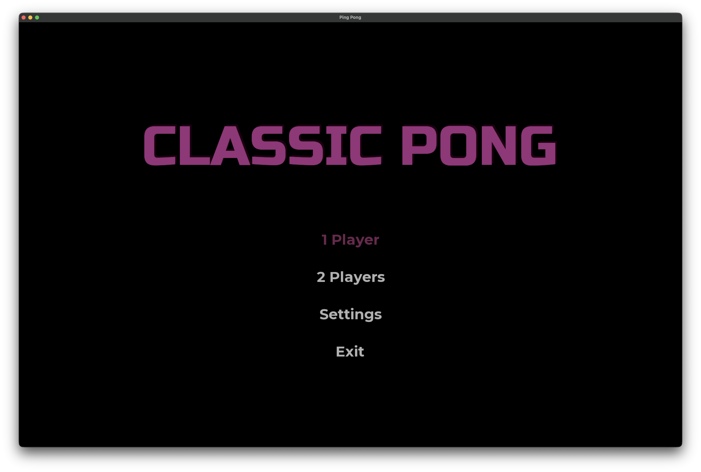
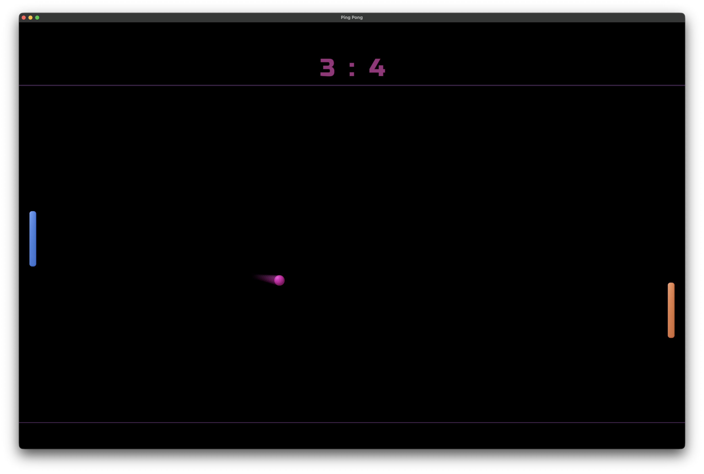
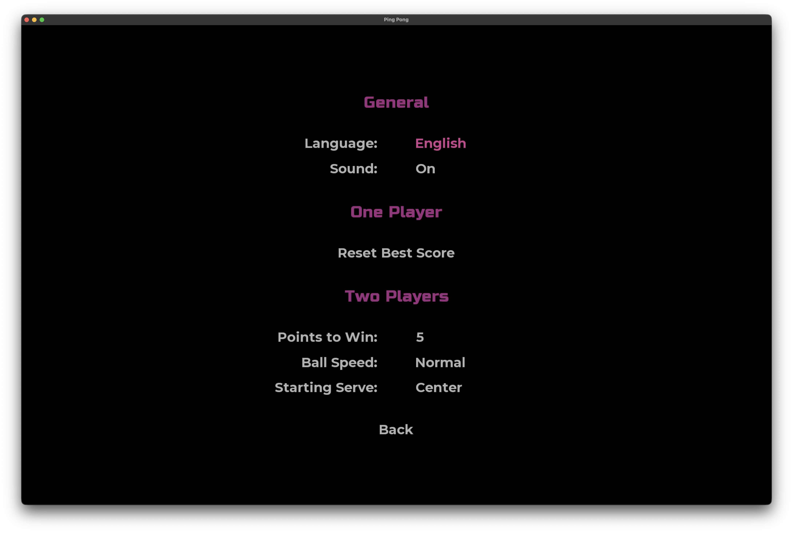

# Classic Pong

A modern, minimalist interpretation of the classic Ping Pong game, built with **Java** and **libGDX**.

The project focuses on smooth physics, responsive controls, and clean UI, while staying true to the original arcade gameplay.

---

## Game Modes

###  Single Player
- Endless mode with increasing difficulty
- Ball speed gradually increases over time
- Best result is saved locally
- Visual and sound feedback on level progression

### Two Players
- Classic Pong for two players on one keyboard
- Customizable rules:
    - Points to win
    - Ball speed
    - Starting serve

---

## Features

- Precise ball physics with edge (side) collisions
- Controlled serve direction based on player input
- Paddle movement affects ball reflection (spin and angle control)
- Configurable game settings
- Sound effects for gameplay and UI interactions
- Pause system and clean state transitions
- Fullscreen support (macOS & Windows)
- Local persistence for best results
- English and Russian language support (switchable)

---

## Controls

- **Menu navigation and Gameplay:** Arrow keys / WASD
- **Confirm:** Enter
- **Pause:** Esc
- **Serve:** Enter / Tab (depending on player)

---

## Screenshots

---

## Tech Stack

- Java 17
- libGDX (LWJGL3 backend)
- Gradle
- jpackage for native builds (macOS / Windows)

---

## Author

- Denis Trunov
- Feb 2026